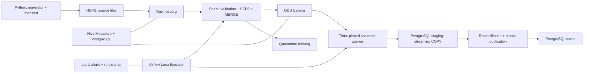

# Banking Lakehouse

Локальная платформа обработки банковских транзакций для портфолио Data Engineer.
Python генерирует детерминированные партии, Spark загружает Raw и обновляет DDS в Iceberg,
Trino рассчитывает витрины, PostgreSQL публикует их транзакционно. Airflow управляет этапами.
Все операции после сборки выполняются внутри локального окружения; облачные аккаунты не нужны.

## Быстрый запуск

Windows PowerShell либо Linux/WSL2, Docker Compose v2+, amd64. Для Windows нужен Docker Desktop
в режиме Linux containers; GNU Make нужен только для команд `make` в Linux/WSL2. Рекомендуется 16 ГБ RAM на
компьютере, 10–12 ГБ для Docker, 4 CPU и минимум 25 ГБ свободного диска. Нагрузочный профиль
10m требует дополнительного диска и времени. Сумма лимитов контейнеров не равна фактическому
потреблению; одновременно JVM драйвера и executor расходуют существенно больше heap.

В Windows PowerShell из корня проекта (устанавливать `make` не нужно):

```powershell
.\lakehouse.ps1 bootstrap
.\lakehouse.ps1 up
.\lakehouse.ps1 demo
```

Если политика PowerShell блокирует `.ps1`, запускайте скрипт через отдельный процесс:

```powershell
powershell -NoProfile -ExecutionPolicy Bypass -File .\lakehouse.ps1 bootstrap
powershell -NoProfile -ExecutionPolicy Bypass -File .\lakehouse.ps1 up
powershell -NoProfile -ExecutionPolicy Bypass -File .\lakehouse.ps1 demo
```

Это не меняет постоянную политику PowerShell. `bootstrap` сохраняет существующий `.env` и собирает образы
в порядке зависимостей. `up` проверяет наличие образов и запускает уже подготовленный стенд.

В Linux/WSL2 с GNU Make:

```bash
make bootstrap
make up
make demo
```

Сборка скачивает закреплённые образы, Hadoop, Hive, Python-пакеты и Iceberg jar. JAR уже находится
в образах: `spark-submit` не использует `--packages` и не обращается в Maven во время работы.
`lake` — сеть `internal: true`. Сервисы с опубликованными интерфейсами дополнительно подключены
к bridge `interfaces` с отключённым IP masquerading и loopback-пробросом портов. Вычислительные
worker/scheduler/metastore остаются только в `lake`. После сборки интернет для обработки не требуется.
Исходный код монтируется одинаково в Spark и Airflow. Запускайте команды из корня репозитория.
В WSL2 лучше хранить проект в Linux-файловой системе (`~/projects`), особенно при больших объёмах.

`make demo` предназначен для выделенного стенда и самостоятельно создаёт маленькие партии.
Запустите его до `make generate`. После успешного демо повторная команда проверяет конечное
состояние. Чтобы повторить все переходы, используйте другое `COMPOSE_PROJECT_NAME` в `.env`
и свободные порты, либо явно удалите тестовые данные через `make reset`.

## Архитектура



HDFS: один NameNode и один DataNode, replication=1. Spark: один master и один worker.
Hive Metastore хранит только каталог, данные и Iceberg metadata JSON находятся в HDFS.
Один PostgreSQL-сервис содержит **раздельные базы** `airflow`, `metastore`, `analytics`.
Все хранилища, логи и исходные партии используют именованные volumes. `make down` их сохраняет.
Инициализация баз повторяема; готовность проверяют healthchecks и `hdfs dfsadmin -safemode wait`.

## Интерфейсы

| Интерфейс | Адрес по умолчанию | Доступ |
|---|---|---|
| Airflow | http://127.0.0.1:8080 | admin / AIRFLOW_ADMIN_PASSWORD из .env |
| Trino | http://127.0.0.1:8081 | user=bank, без пароля в локальной сети |
| Spark master UI | http://127.0.0.1:8082 | состояние worker и приложений |
| HDFS NameNode | http://127.0.0.1:9870 | файлы и состояние HDFS |
| Alerts | http://127.0.0.1:8090 | последние 100 локальных событий |
| PostgreSQL | 127.0.0.1:5432 | analytics, bank / POSTGRES_PASSWORD |

Все опубликованные порты привязаны к loopback. Это учебный стенд без Kerberos и TLS;
учётные данные из примера предназначены для локального использования. В `.env` меняются порты,
лимиты контейнеров, heap Trino, память Spark, CPU и число shuffle partitions.
Для парольных полей в Airflow URL используйте буквы, цифры и дефисы.

Docker Engine 29 в проверенной среде не публиковал порты сервисов, подключённых исключительно
к internal-сети. Поэтому для интерфейсов используется отдельный bridge, а взаимодействие
с внутренними компонентами идёт через lake. Подробнее: [Docker networking](https://docs.docker.com/compose/how-tos/networking/).

## Версии и совместимость

| Компонент | Закреплённая версия | Причина |
|---|---|---|
| Spark / PySpark | 3.5.3 | стабильная ветка с MERGE и Iceberg SQL extensions |
| Scala | 2.12, поставка PySpark | соответствует суффиксу Iceberg runtime |
| Iceberg | 1.7.1, `iceberg-spark-runtime-3.5_2.12` | поддержка Spark 3.5, таблицы format-version=2 |
| Java Spark / Airflow | 17, OpenJDK из Debian Bookworm | поддерживается Spark 3.5 |
| Hadoop HDFS | 3.3.6 | WebHDFS, совместимость HDFS 3.x клиентов |
| Hive Metastore | 3.1.3 / Java 8u432 | самостоятельный Thrift metastore; HiveServer2 не нужен |
| Trino | 468 | Iceberg v1/v2, Hive Metastore, `fs.hadoop.enabled=true` |
| Airflow | 2.10.5 / Python 3.11 | LocalExecutor, scheduler + webserver, PostgreSQL backend |
| PostgreSQL | 16.6 | metadata, COPY, оконные запросы, атомарная публикация |

Проверены официальные материалы и исходные документы закреплённых релизов:

- [Spark 3.5.3: Java 8/11/17, Python, Scala](https://github.com/apache/spark/blob/v3.5.3/docs/index.md).
- [Iceberg 1.7.1: поддерживаемые движки и runtime artifacts](https://github.com/apache/iceberg/blob/apache-iceberg-1.7.1/site/docs/multi-engine-support.md).
- [Trino 468: Iceberg connector, формат v1/v2 и файловые системы](https://github.com/trinodb/trino/blob/468/docs/src/main/sphinx/connector/iceberg.md).
- [Airflow 2.10.5: LocalExecutor](https://github.com/apache/airflow/blob/2.10.5/docs/apache-airflow/core-concepts/executor/local.rst).
- [Hive: внешний PostgreSQL для metastore](https://hive.apache.org/docs/latest/admin/setting-up-hive-with-docker/).

Spark использует собственный Hadoop-клиент из поставки PySpark, HDFS-сервер — 3.3.6. Hive
использует Hadoop 3.3.6, его старый Guava заменён на Guava из Hadoop во избежание конфликта API.
Hive не исполняет Iceberg-запросы: Spark обращается через `HiveCatalog`, Trino — через свой
Iceberg connector. Поэтому Hive Iceberg execution runtime в metastore не требуется.
Trino использует собственную версию Iceberg; совпадение JAR с Spark не требуется при общем
поддерживаемом формате таблиц. Документация подтверждает интерфейсы, но не заменяет
интеграционный прогон конкретной комбинации. Фактически выполненные проверки описаны в
[docs/validation.md](docs/validation.md). Версии Java ОС и транзитивные зависимости базовых
образов могут меняться при повторной сборке: для архивирования окружения сохраните image IDs
и `pip freeze`; это не полностью герметичная сборка.

## Команды

| Команда | Назначение |
|---|---|
| `make bootstrap` | создать .env при отсутствии, проверить Compose, собрать образы в порядке зависимостей |
| `make up` | запустить сервисы и дождаться healthchecks |
| `make generate DATE=2025-01-01 PROFILE=small` | создать исходную партию в volume /data |
| `make demo` | проверяемый сценарий с заранее известным результатом |
| `make test` | быстрые локальные Python-тесты |
| `make integration-test` | демо, импорт DAG, остановка/запуск и сохранность данных |
| `make backfill START=2025-01-01 END=2025-01-03` | последовательная обработка диапазона включительно |
| `make benchmark PROFILE=1m REPEATS=3` | отдельный измеряемый Spark-эксперимент |
| `make schema-demo` | разрешённое добавление memo и проверка запрета смены DECIMAL на STRING |
| `make maintenance` | перепаковка малых файлов и manifest в Iceberg |
| `make status` | состояние и фактический расход ресурсов |
| `make down` | остановить без удаления volumes |
| `make reset` | удалить volumes **только после ввода DELETE** |

Для быстрых тестов на хосте используйте отдельное виртуальное окружение:

```bash
python3 -m venv .venv
source .venv/bin/activate
pip install -r requirements-dev.txt
make test
python -m ruff check .
```

В Windows все действия из таблицы доступны через `.\lakehouse.ps1 <команда>`. Примеры:

```powershell
.\lakehouse.ps1 generate -Date 2025-01-01 -Profile small
.\lakehouse.ps1 backfill -Start 2025-01-01 -End 2025-01-03
.\lakehouse.ps1 benchmark -Profile 1m -Repeats 3
.\lakehouse.ps1 status
.\lakehouse.ps1 down
```

`-DryRun` выводит команды без выполнения. `reset` требует ввода `DELETE` перед удалением volumes.
Для локальных Python-тестов создайте `.venv` командой `python -m venv .venv`, установите зависимости
через `.\.venv\Scripts\python.exe -m pip install -r requirements-dev.txt` и выполните `.\lakehouse.ps1 test`.
Скрипт автоматически использует Python из `.venv`, активация окружения не требуется.

После `make generate` команда выводит `batch_id`. Обработать её:

```bash
docker compose exec -T airflow-scheduler python -m bank.cli run <batch_id>
```

Генератор поддерживает `--scenario initial|daily|duplicates|correction|cancel|late|customer-late|invalid`,
`--seed` и `--profile small|1m|10m`. Нагрузочная генерация пишет по 100 000 записей на файл,
не держит набор в памяти. Суммы создаются из целого числа копеек, без float.
Учебный генератор открывает счета 2025-01-01: используйте даты не раньше этого дня.

## Модель и бизнес-правила

- Raw: `lake.raw.records`, одна строка на исходную запись. Полный JSON сохраняется в `payload`;
  служебные поля: entity, batch_id, source_file, source_record_id, ingested_at, schema_version.
  MERGE по партии, сущности и ID исходной записи исключает дубли повторной загрузки.
  Бизнес-дубли с различными исходными ID сохраняются для аудита.
- Manifest: идентификатор партии зависит от даты, профиля, списка файлов и их SHA-256.
  Размеры партий не влияют на память проверки. Сначала проверяется manifest, потом исходники
  загружаются через WebHDFS с временным файлом и атомарным rename. Партии неизменяемы.
- DDS: `customers`, `accounts`, `customer_history`, `transactions`, `quarantine` в Iceberg.
  День операции — UTC; время получения `received_at` отделено от `event_at`/`effective_at`.
- Валидация принимает только перечисленные поля схемы. v2 разрешает необязательный `memo`
  после явной миграции. Новые неизвестные поля и неизвестные версии блокируют загрузку.
- Деньги: `DECIMAL(18,2)` в фактах, `DECIMAL(38,2)` / `NUMERIC(38,2)` в агрегатах.
  Суммы строго положительные, направление IN/OUT хранится отдельно. RUB/USD/EUR не смешиваются.
- Победитель транзакции: record_version DESC, source_updated_at DESC, SHA-256 нормализованного
  бизнес-payload DESC. Технический source_record_id не участвует в хеше. Так конфликты
  одинаковой версии разрешаются детерминированно, независимо от порядка прихода.
- Невалидная запись остаётся в Raw и quarantine. Она не заменяет ранее принятую корректную
  версию. Допустимая доля отклонений — DQ_MAX_REJECT_RATIO; превышение блокирует DDS/публикацию.
  Нарушение ключей, SCD или сверки сумм всегда критично. Причины карантина доступны через Trino.
- POSTED участвует в витринах. PENDING и CANCELLED не участвуют. Более новая отмена убирает
  прежнюю проведённую операцию. Исправление заменяет сумму, дату и канал одной операции.
- SCD2: `[valid_from,valid_to)`, `valid_to=NULL` для текущей версии. При одинаковом effective_at
  выбирается change_version DESC, затем hash DESC. Повтор неизменённых атрибутов не открывает
  новую версию. Позднее изменение восстанавливает интервалы из упорядоченных Raw-событий и
  меняет customer_version_id фактов. Это бизнес-история, отдельно от Iceberg snapshots.
- `mart_customer_activity` имеет ключ **клиент × день × валюта**: валюта добавлена к запрошенной
  гранулярности для исключения некорректного смешивания денег. [Словарь](docs/data-dictionary.md).

## Оркестрация, конкуренция и восстановление

DAG `banking_daily` содержит последовательные задачи manifest → raw → validate → dds → calculate →
stage → reconcile → publish → finish. Дата берётся из `dag_run.conf.processing_date` или начала
data interval; текущие часы используются только для технических меток и мониторинга.
Больших XCom нет. DAG по умолчанию на паузе, catchup=False, max_active_runs=1.

```bash
docker compose exec airflow-scheduler airflow dags trigger banking_daily \
  --conf '{"processing_date":"2025-01-02"}'
docker compose exec airflow-scheduler airflow dags unpause banking_daily
```

Конфигурация может содержать готовый `batch_id`. Если его нет, DAG генерирует daily-партию.
CLI backfill использует тот же код этапов. Для начальной загрузки генерируйте initial-партию.
Ретраи Airflow: 2, таймаут задачи 1 час. Журналы: batches, runs, stage_metrics, reconciliation.

PostgreSQL advisory lock сериализует каждый этап; долговечная строка pipeline_lock удерживает
владение между задачами DAG. CLI, DAG и maintenance используют общий протокол. При штатной
ошибке CLI освобождает владение и сохраняет алерт, DAG освобождает его при окончательной ошибке.
При аварийном завершении процесса владение остаётся. Повторите **тот же run_id** через
`python -m bank.cli run <batch_id> --run-id <owner>`: все этапы безопасны для повтора.
Для Airflow предпочтительно очистить задачи того же DAG run. Не удаляйте строку владения,
пока не убедились, что старый процесс остановлен.

После DDS фиксируются snapshot IDs транзакций и истории. Все Trino-запросы staging читают эти
снимки через `FOR VERSION AS OF`. Расчёт сохраняет CSV и manifest экспорта в `/data/exports`,
читая Trino пакетами до 2000 строк; staging проверяет SHA-256 и передаёт COPY блоками 1 MiB.
Сверка идёт по каждой
валюте, дополнительно проверяется активность и история. Все три витрины заменяются через
DELETE+INSERT в **одной транзакции** с published_at. Читатели сохраняют прежнюю версию до COMMIT.
TRUNCATE не применяется. Ошибка внутри публикации откатывает и таблицы, и маркер.

Общей транзакции Iceberg/PostgreSQL нет. DDS может опережать опубликованные витрины после сбоя;
повторный запуск восстанавливает витрины. Здесь полный пересчёт Raw/DDS-истории и витрин выбран
для прозрачности поздних событий: MERGE фактов обновляет только изменившиеся операции, но
поиск победителей читает всю историю. Это ограничение масштабирования; не заявляется
инкрементальное чтение только затронутых партиций или промышленная exactly-once гарантия.

## Демо и эксплуатация

Демо проверяет начальные суммы 150 RUB / 7.50 USD; повтор; исправление D1 с переносом на другой
день и канал; отмену D2; позднюю DL; поздний PREMIUM-интервал; три сбоя публикации/сверки;
восстановление; критичный карантин; добавление memo и чтение старой схемы.
Итог: **191 RUB и 7.50 USD**, 7 DDS-транзакций, включая отменённую и ожидающую.
При нарушении assert или этапе с ошибкой команда завершается ненулевым кодом.
Результат находится в `/data/demo-result.json`. `integration-test` дополнительно проверяет
Raw и витрины после остановки и повторного запуска всех контейнеров.

Отдельно можно проверить рабочие Spark-преобразования с локальным Iceberg HadoopCatalog,
без запуска остальных сервисов: `bash scripts/spark-checks.sh` (PowerShell:
`./scripts/spark-checks.ps1`). Это дополнительная проверка Spark/Iceberg, она не заменяет
сквозной прогон HDFS + Hive + Trino + Airflow. PostgreSQL-проверки транзакций:
`docker compose exec -T airflow-scheduler python -m bank.postgres_checks`.
Дополнительная диагностика распределённого Spark и HDFS без Hive/Trino:
`bash scripts/distributed-smoke.sh`. Она использует отдельный HadoopCatalog под
`/warehouse/smoke` и не подменяет основной Hive Metastore catalog.

```bash
docker compose exec -T trino trino --execute 'SELECT reason,count(*) FROM iceberg.dds.quarantine GROUP BY reason'
docker compose exec -T postgres psql -U bank -d analytics -c 'TABLE stage_metrics'
docker compose exec -T airflow-scheduler python -m bank.cli freshness --max-age 86400
docker compose logs --tail 100 airflow-scheduler metastore trino
```

Алерты сохраняются сначала в PostgreSQL, затем отправляются локальному receiver.
Недоступность receiver не скрывает исходную ошибку. Демо моделирует устаревание, передавая
монитору контролируемое время на два дня вперёд. Для регулярного мониторинга запускайте
команду freshness из локального cron либо собственного Airflow расписания.

`make maintenance` вызывает Spark Iceberg `rewrite_data_files` и `rewrite_manifests`.
Не выполняется автоматическое удаление snapshots: они нужны для аудита и time travel.
В долгом стенде хранение Raw и старых snapshots растёт; отдельно задайте политику retention,
прежде чем вручную вызывать expire_snapshots. Удаление snapshots во время экспорта запрещено.

SQL с CTE, historical join, cumulative turnover, lag и dense_rank: [sql/trino/analytics.sql](sql/trino/analytics.sql).
Вариант сравнения календарных дней и Power BI: [docs/data-dictionary.md](docs/data-dictionary.md),
[docs/power-bi.md](docs/power-bi.md). Power BI не нужен для демо и тестов.

## Измерения и ограничения

[docs/benchmark.md](docs/benchmark.md) описывает воспроизводимый эксперимент и реальные артефакты.
Не переносите настройки candidate в основной pipeline до измерения. Отдельный benchmark
меняет партиционирование, target file size, shuffle и broadcast, сохраняет планы и event metrics.
Базовые настройки pipeline — консервативный локальный бюджет, не заявление об ускорении.

При нехватке памяти проверяйте `docker compose stats --no-stream`, OOMKilled и свободную память
Docker. `TRINO_HEAP` согласуйте с `query.max-memory-per-node` и heap headroom в config.properties.
Снижение executor memory без изменения worker/container лимита не ограничивает Python и JVM overhead.
Свободные порты изменяются через .env. Если DataNode не готов, проверьте DNS `datanode` и
`hdfs dfsadmin -report`; IP DataNode не должен быть адресом хоста Windows.
Ошибка schema initialization Hive разбирается по `docker compose logs metastore`; schema verification
не отключается. Пароль существующего PostgreSQL volume не меняется от редактирования .env.

Репозиторий: infra/ — контейнеры и конфигурации, src/bank/ — Python, jobs/ — Spark,
dags/ — Airflow, sql/ — расчёты, tests/ — быстрые проверки, scripts/ — интеграция, docs/ — документация.
